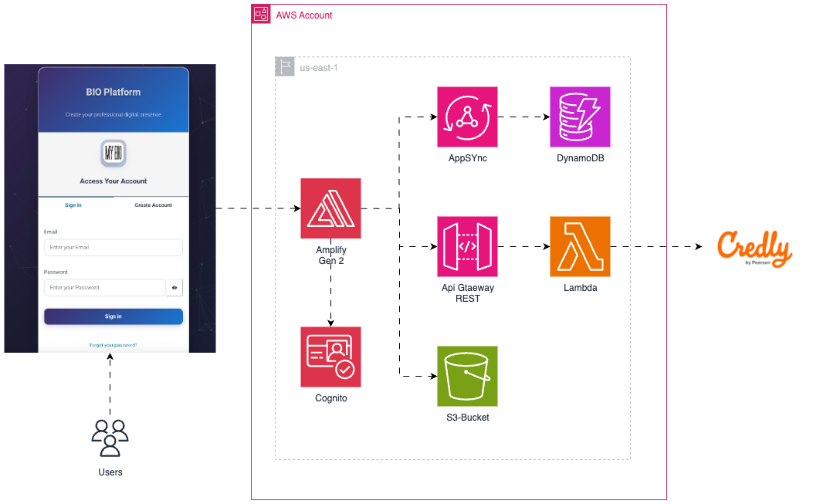

# 🚀 BIO Platform - Personal Biography & Portfolio Builder




<div align="center">


[](https://aws.amazon.com/amplify/)
[](https://vuejs.org/)
[](https://quasar.dev/)
[](https://www.typescriptlang.org/)
[](https://aws.amazon.com/cdk/)

_Create stunning personal biography websites with professional portfolios, social media integration, and Credly certifications showcase_

• [📖 Documentation](#documentation) • [🚀 Quick Start](#quick-start) • [🤝 Contributing](#contributing)

</div>

---

## ✨ Features

### 🎯 Core Functionality

- **🎨 Dynamic Personal Profiles**: Create beautiful, responsive biography pages with custom themes
- **🌐 Custom Subdomains**: Each user gets their own subdomain (e.g., `yourname.bio.awslearn.cloud`)
- **📱 Responsive Design**: Optimized for desktop, tablet, and mobile devices
- **🎭 Interactive Animations**: Particle.js animations with customizable colors and effects

### 🔗 Social Media Integration

- **📲 Multi-Platform Support**: LinkedIn, GitHub, Medium, Facebook, Instagram, YouTube, Twitter/X
- **🔗 Smart URL Validation**: Automatic validation of social media URLs
- **👁️ Visibility Controls**: Show/hide specific social networks on your profile
- **🎯 One-Click Redirects**: Direct links to all your social platforms

### 🏆 Professional Certifications

- **🎓 Credly Integration**: Automatic fetching and display of Credly badges
- **🔄 Real-time Updates**: Sync your latest certifications automatically
- **🖼️ Visual Badge Display**: Professional badge showcase with click-to-verify functionality
- **📊 Certification Management**: Easy management of multiple certification providers

### 🔐 Authentication & Security

- **🔒 AWS Cognito Integration**: Secure user authentication and authorization
- **👤 User Management**: Complete user profile management system
- **🛡️ Role-based Access**: Secure API endpoints with proper authorization
- **🔑 Session Management**: Automatic token refresh and session handling

### 🎨 Customization Options

- **🌈 Color Themes**: Custom color picker for personalized branding
- **📸 Image Upload**: Secure image storage with AWS S3 integration
- **✏️ Rich Text Editing**: Comprehensive biography and description editing
- **🎯 SEO Optimization**: Meta tags, Open Graph, and Twitter Card support

---

## 🏗️ Architecture

### Frontend Stack

```
Vue.js 3 (Composition API) + TypeScript
├── 🖼️ Quasar Framework (UI Components)
├── 🗂️ Pinia (State Management)
├── 🛣️ Vue Router (Navigation)
├── 🎨 Particle.js (Animations)
└── 📱 Responsive Design (Mobile-First)
```

### Backend Infrastructure (AWS)

```
AWS Amplify Fullstack
├── 🔐 Amazon Cognito (Authentication)
├── 🗄️ Amazon DynamoDB (Database)
├── 📦 Amazon S3 (File Storage)
├── ⚡ AWS Lambda (Serverless Functions)
├── 🌐 Amazon API Gateway (REST API)
└── 🚀 AWS CDK (Infrastructure as Code)
```

### Key Components Architecture

```
src/
├── 📄 pages/
│   ├── IndexPage.vue          # Admin dashboard for profile editing
│   ├── IndexUsersPage.vue     # Public profile display
│   └── Login.vue              # Authentication page
├── 🧩 components/
│   └── BioComponent.vue       # Main profile display component
├── 🗂️ stores/
│   ├── User.ts                # User authentication state
│   └── General.ts             # Application data management
├── 🛣️ router/
│   ├── routes.ts              # Admin routes
│   └── routesUser.ts          # Public profile routes
└── 🔧 amplify/
    ├── backend.ts             # AWS infrastructure definition
    ├── data/resource.ts       # Database schema
    └── functions/             # Lambda functions
```

---

## 🚀 Quick Start

### Prerequisites

- **Node.js** 18+ or 20+
- **npm** 6.13.4+
- **AWS Account** with appropriate permissions
- **AWS CLI** configured (optional but recommended)

### 1-Minute Setup

```bash
# Clone the repository
git clone https://github.com/4l3j4ndr0/my-bio.git
cd bio-platform

# Install dependencies
npm install

# Start development server
npm run dev

# In another terminal, start AWS Amplify sandbox
npx ampx sandbox
```

🎉 **That's it!** Your BIO Platform is now running at `http://localhost:9000`

---

## 🛠️ Installation

### Detailed Installation Steps

1. **Clone and Setup**

   ```bash
   git clone https://github.com/4l3j4ndr0/my-bio.git
   cd my-bio
   npm install
   ```

2. **AWS Configuration**

   ```bash
   # Configure AWS credentials (if not already done)
   aws configure

   # Or use AWS profiles
   npx ampx sandbox --profile your-aws-profile
   ```

3. **Database Initialization**

   ```bash
   # Deploy AWS resources
   npx ampx sandbox

   # The database schema will be automatically created
   ```

---

## 📱 Usage

### For End Users

1. **Create Account**

   - Visit the platform and sign up with email
   - Verify your email address
   - Complete your profile setup

2. **Build Your Profile**

   - Upload a professional photo
   - Add your personal information
   - Write a compelling biography
   - Choose your custom subdomain

3. **Add Social Networks**

   - Connect your LinkedIn, GitHub, and other profiles
   - Toggle visibility for each platform
   - Validate URLs automatically

4. **Showcase Certifications**

   - Connect your Credly account
   - Automatically sync your badges
   - Display professional certifications

5. **Customize Appearance**
   - Choose your brand colors
   - Preview changes in real-time
   - Optimize for mobile devices

### For Developers

#### Adding New Features

```typescript
// Example: Adding a new certification provider
export const useGeneralStore = defineStore("general", {
  actions: {
    async getNewProviderCertifications(username: string) {
      // Implementation for new provider
    },
  },
});
```

#### Custom Components

```vue
<template>
  <bio-component
    :primary-color="color"
    :user-image="userImage"
    :user-name="userName"
    :user-position="userPosition"
    :user-bio="userBio"
    :user-social-networks="userSocialNetworks"
    :user-credly-badges="userCredlyBadges"
  />
</template>
```

---

## 🔧 Development

### Development Commands

```bash
# Start development server
npm run dev

# Build for production
npm run build

# Start AWS Amplify sandbox
npx ampx sandbox

# Clean Quasar cache
npx quasar clean

# Update dependencies
npm update

# Run with specific AWS profile
npx ampx sandbox --profile your-profile
```

### Code Structure Best Practices

#### Vue 3 Composition API

```typescript
<script setup lang="ts">
import { ref, onMounted, computed } from 'vue';
import { useUserStore } from 'src/stores/User';

const user = useUserStore();
const userData = ref(null);

const computedValue = computed(() => {
  return userData.value?.name || 'Default Name';
});

onMounted(async () => {
  userData.value = await user.getCurrentUser();
});
</script>
```

#### Pinia Store Pattern

```typescript
export const useUserStore = defineStore("user", {
  state: () => ({
    currentUser: null,
    isAuthenticated: false,
  }),

  getters: {
    userName: (state) => state.currentUser?.name || "",
  },

  actions: {
    async login(credentials) {
      // Authentication logic
    },
  },
});
```

---

## 🚀 Deployment

### AWS Amplify Deployment

```bash
# Deploy to AWS
npx ampx sandbox deploy

# Deploy with specific environment
npx ampx sandbox deploy --profile production
```

### Manual Deployment Steps

1. **Build the application**

   ```bash
   npm run build
   ```

2. **Deploy AWS resources**

   ```bash
   npx ampx sandbox deploy
   ```

3. **Configure custom domain** (optional)
   - Set up Route 53 hosted zone
   - Configure SSL certificates
   - Update DNS records

### Environment-Specific Deployments

```bash
# Development
npx ampx sandbox --profile dev

# Staging
npx ampx sandbox --profile staging

# Production
npx ampx sandbox --profile production
```

---

## 🤝 Contributing

We welcome contributions! Here's how you can help:

### Getting Started

1. **Fork the repository**
2. **Create a feature branch**
   ```bash
   git checkout -b feature/amazing-feature
   ```
3. **Make your changes**
4. **Add tests** (if applicable)
5. **Commit your changes**
   ```bash
   git commit -m 'Add amazing feature'
   ```
6. **Push to the branch**
   ```bash
   git push origin feature/amazing-feature
   ```
7. **Open a Pull Request**

### Development Guidelines

- Follow Vue 3 Composition API patterns
- Use TypeScript for type safety
- Follow Quasar Framework conventions
- Write meaningful commit messages
- Add documentation for new features
- Ensure responsive design compatibility

### Code Style

```bash
# Format code
npm run format

# Lint code
npm run lint

# Type check
npm run type-check
```

---

## 🐛 Troubleshooting

### Common Issues

#### 1. TypeScript Configuration Error

```bash
# Error: failed to resolve "extends":"@quasar/app-vite/tsconfig-preset"
# Solution: Update tsconfig.json with complete configuration
```

#### 2. AWS Amplify Sandbox Issues

```bash
# Clean and restart
npx quasar clean --qconf
npx ampx sandbox
```

#### 3. Node.js Version Compatibility

```bash
# Use Node.js 18+ or 20+
nvm use 20
npm install
```

#### 4. Dependency Issues

```bash
# Clear cache and reinstall
rm -rf node_modules package-lock.json
npm install
```

### Debug Mode

```bash
# Enable debug logging
DEBUG=* npm run dev

# AWS Amplify debug
AWS_AMPLIFY_DEBUG=true npm run dev
```

---

## 📊 Performance Optimization

### Frontend Optimization

- **Code Splitting**: Automatic route-based code splitting
- **Lazy Loading**: Components loaded on demand
- **Image Optimization**: WebP format support with fallbacks
- **Caching**: Intelligent browser caching strategies

### Backend Optimization

- **Lambda Cold Start**: Optimized function packaging
- **DynamoDB**: Efficient query patterns and indexing
- **S3**: CloudFront CDN integration for global delivery
- **API Gateway**: Request/response caching

---

## 🔒 Security

### Security Features

- **Authentication**: AWS Cognito with MFA support
- **Authorization**: Role-based access control
- **Data Encryption**: At-rest and in-transit encryption
- **Input Validation**: Comprehensive input sanitization
- **CORS**: Properly configured cross-origin policies

### Security Best Practices

```typescript
// Input validation example
const validateUrl = (val: string) => {
  const pattern =
    /^(https?:\/\/)?([\da-z\.-]+)\.([a-z\.]{2,6})([\/\w \.-]*)*\/?$/;
  return pattern.test(val) || "Please enter a valid URL";
};
```

---

## 📄 License

This project is licensed under the MIT License - see the [LICENSE](LICENSE) file for details.

---

## 🙏 Acknowledgments

- **AWS Amplify Team** for the amazing fullstack platform
- **Vue.js Community** for the incredible framework
- **Quasar Framework** for the beautiful UI components
- **Credly** for the certification API integration
- **All Contributors** who help make this project better

---

<div align="center">

**Made with ❤️ by Alejandro Castaneda Ocampo**

[⭐ Star us on GitHub](https://github.com/4l3j4ndr0/my-bio)

</div>
